

  <h1>Talent Fest - Citi Bank</h1>
⚛️ 🤳 🚀

## 📑 Índice
- [📑 Índice](#-índice)
- [1. Talent Fest 🎉](#1-talent-fest-)
- [2. Citi Bank 💵](#2-citi-bank-)
- [3. Desafio 🎯](#3-desafio-)
- [4. A Aplicação 💡](#4-a-aplicação-)
- [5. Planejamento  📆](#5-planejamento--)
- [6. Protótipo  🖥️ 📱](#6-protótipo--️-)
- [7. Interface Final 🎨](#7-interface-final-)
- [8. Tecnologias ⚙️](#8-tecnologias-️)
- [9. Desenvolvedoras 👩‍💻](#9-desenvolvedoras-)

## 1. Talent Fest 🎉
Chegamos ao fim do *bootcamp* da [Laboratória](https://www.laboratoria.la/br) e o [Talent Fest](https://talentfest.laboratoria.la/br/empresas-participantes) é um hackathon organizado pela Laboratoria ao final de cada Bootcamp para conectar as alunas ao mercado de tecnologia. É o espaço perfeito para que as empresas conheçam o potencial do talento feminino da Laboratoria, pois as estudantes trabalham com cases reais propostos pelas organizações participantes.

## 2. Citi Bank 💵

O [**Citi**](https://corporateportal.brazil.citibank.com/index.htm) é o banco mais globalizado do mundo, com mais de 200 anos de atuação. Mantém presença em 96 países, 21 deles na América Latina, possui 200 milhões de contas de clientes e emprega mais de 200 mil pessoas. Disponibiliza para pessoas, corporações, governos e instituições uma variedade de produtos e serviços financeiros, incluindo serviços bancários e de crédito ao consumidor, serviços bancários corporativos e de investimento e corretagem de valores.

## 3. Desafio 🎯

E como um último teste, recebemos da empresa [**Citi**](https://corporateportal.brazil.citibank.com/index.htm) um desafio:

<h1>
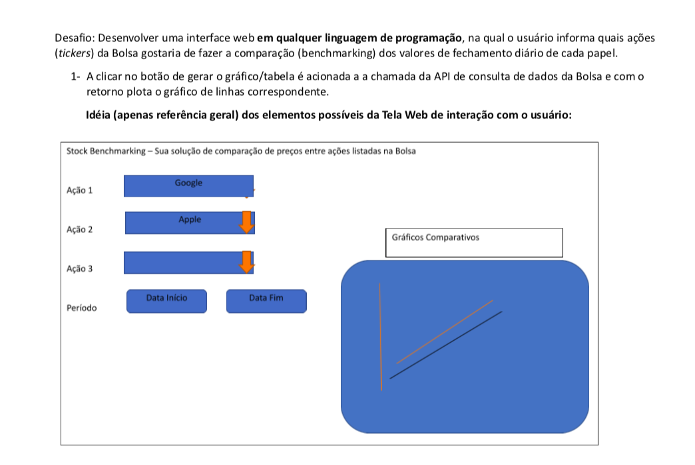
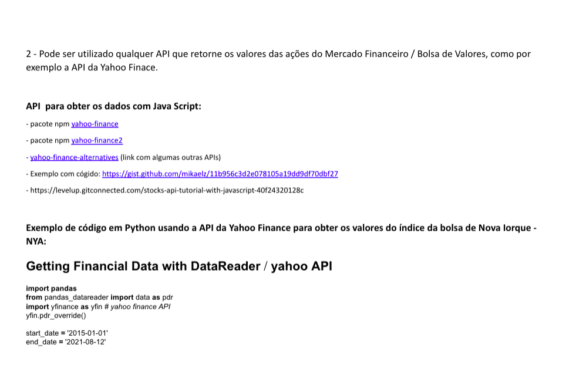
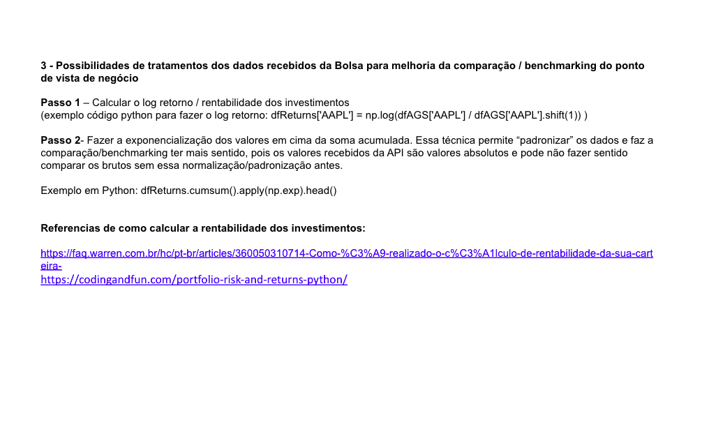
</h1>

## 4. A Aplicação 💡

Com o desafio em mãos iniciamos o processo tentando entender como criaríamos e da parte do Citi qual seria o público alvo. O maior desafio foi entender um pouco a parte de investimentos/bolsa de valores proposto pelo Citi.

A escolha da linguagem para fazer a aplicação foi livre, e então escolhemos JavaScript e requisitamos uma API da bolsa de valores de Nova York e o conforme a pessoa escolhe a data do investimento aparece as informações em um gráfico.

[Clique aqui para ver nosso site!](https://desafio-citi-sap006.herokuapp.com/)
## 5. Planejamento  📆
Nosso planejamento foi feito pelo GitHub Projects:

<h1>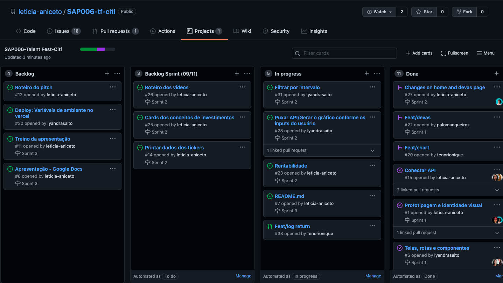</h1>

## 6. Protótipo  🖥️ 📱

Fizemos nosso protótipo, desktop e mobile de alta fidelidade pelo Figma:

<h1>
  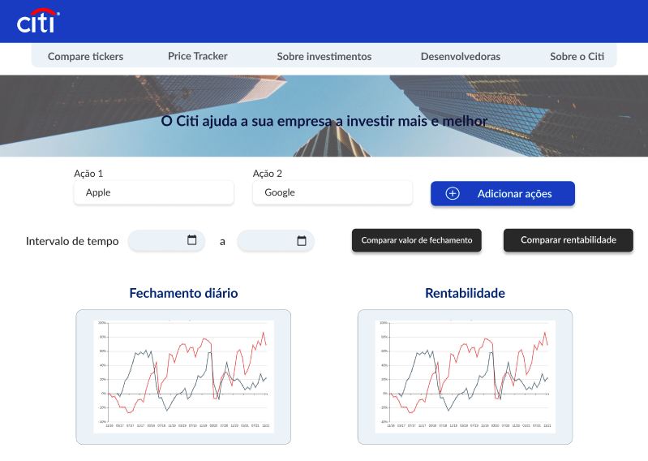
  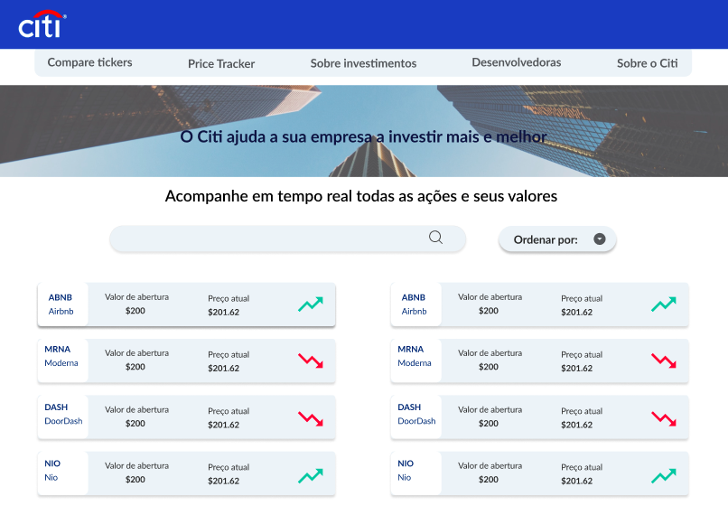
  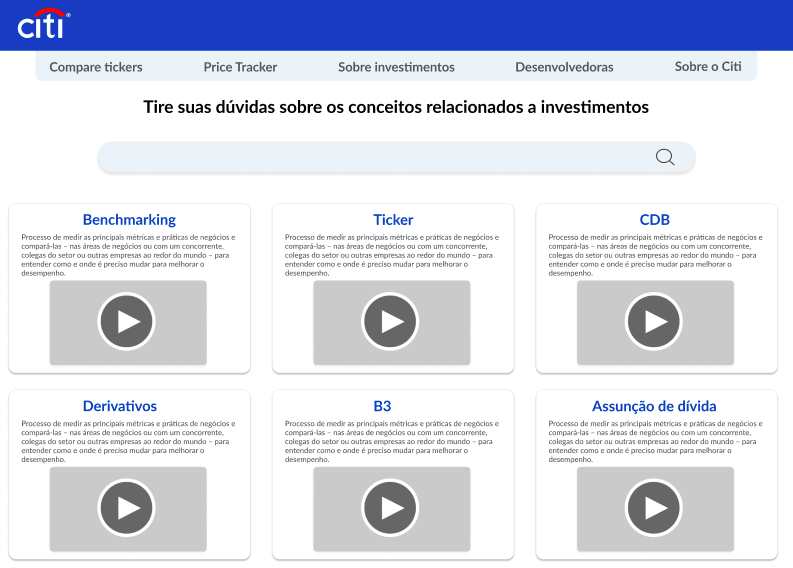
  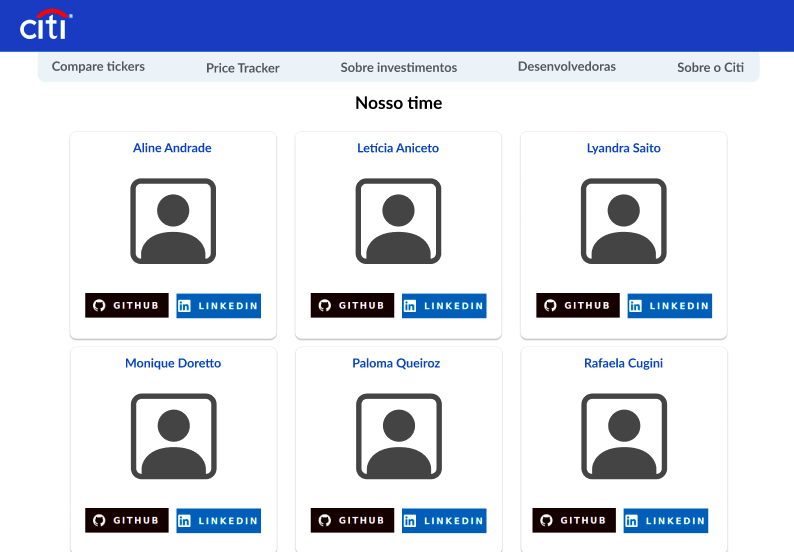
  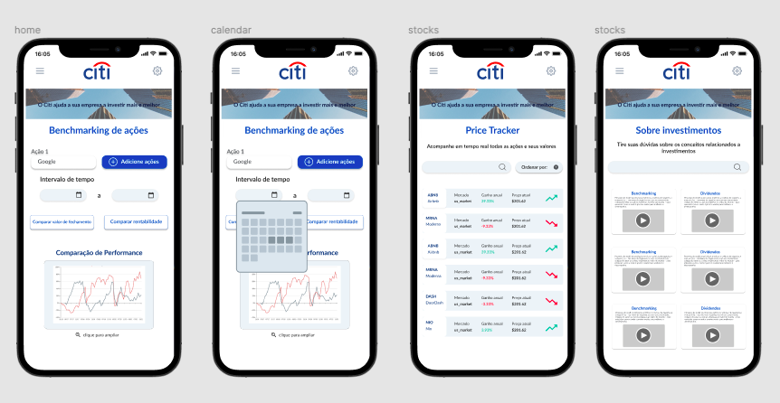
</h1>

## 7. Interface Final 🎨

<h1>
  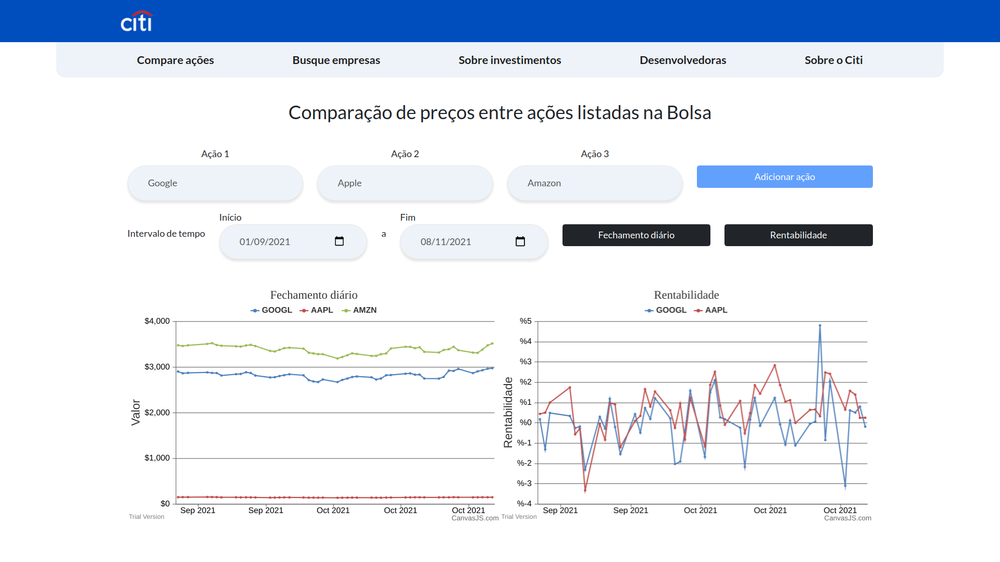
  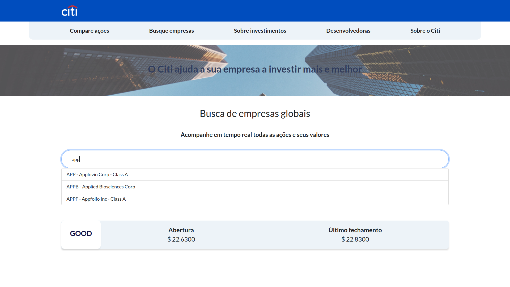
  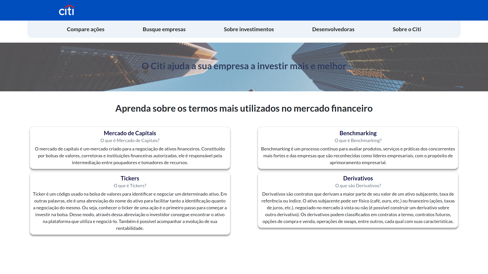
</h1>

## 8. Tecnologias ⚙️

Utilizamos as seguintes ferramentas:

 
  
  
    
    
    
    
    

## 9. Desenvolvedoras 👩‍💻 

 
| </img> | </img> | </img> | </img>| </img> | </img>   	|
|:-----------------:	|:-----------------:	|:------------------:	|:-----------------:	|:-----------------:	|:-----------------:	|
|<a href='https://github.com/AlineFAndrade'></img></a> <a href='https://www.linkedin.com/in/AlineFAndrade/'></img></a> | <a href='https://github.com/leticia-aniceto'></img></a> <a href='https://www.linkedin.com/in/leticia-braga-aniceto/'></img></a> | <a href='https://github.com/lyandrasaito'></img></a> <a href='https://www.linkedin.com/in/lyandrasaito/'></img></a> | <a href='https://github.com/tenorionique'></img></a> <a href='https://www.linkedin.com/in/tenorionique/'></img></a> | <a href='https://github.com/palomacqueiroz'></img></a> <a href='https://www.linkedin.com/in/palomac-queiroz/'></img></a> | <a href='https://github.com/RafaelaCugini'></img></a> <a href='https://www.linkedin.com/in/RafaelaCugini/'></img></a> |

